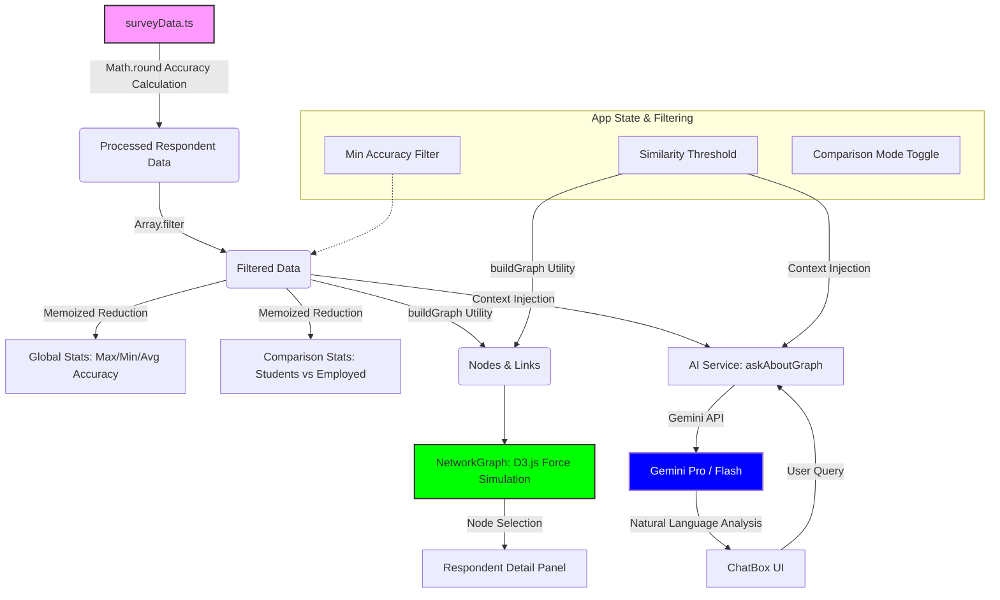

# Application Data Flow

This diagram illustrates how data flows through the **AI Perception Network** application, from raw data processing to user interaction and AI analysis.

## Key Components

1.  **Data Processing**: Raw answers are compared against a `GROUND_TRUTH` array to calculate an accuracy percentage for each of the 173 respondents.
2.  **Interactive Filtering**: The application re-calculates the network and statistics in real-time as users adjust the "Similarity Threshold" or "Minimum Accuracy" filters.
3.  **Network Topology**: Links are generated only between respondents who share a specific number of identical answers, revealing clusters of shared perception (homophily).
4.  **AI Analyst Context**: Every time a user asks a question, the current filtered data state (averages, photo names, threshold) is injected into the AI prompt as structured context.
