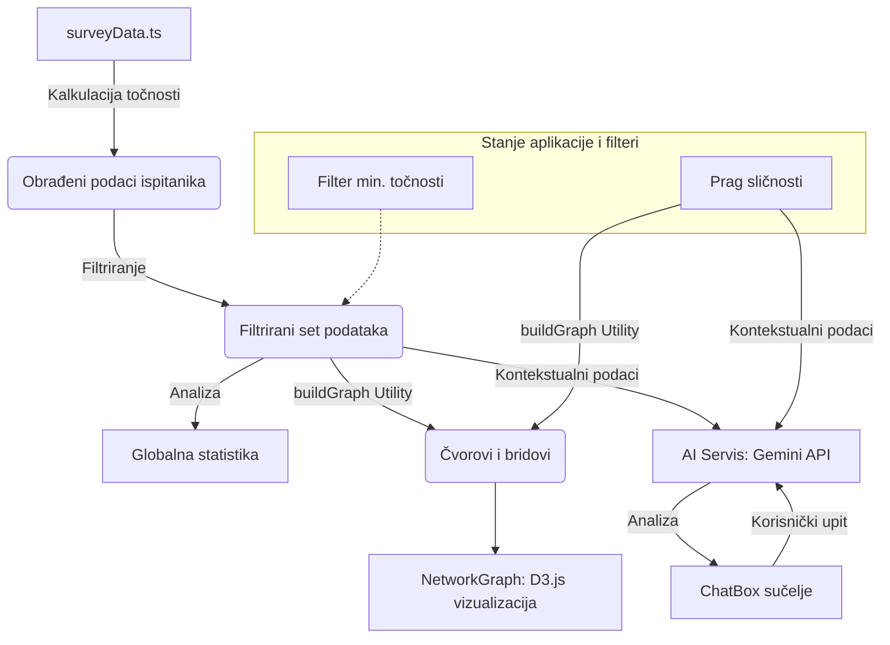

# Percepcija Umjetne Inteligencije u Fotografiji: Mrežna Analiza Demografskih Skupina

*Slika 1. Konceptualni prikaz granice između stvarne i generirane stvarnosti.*

## Sažetak (Abstract)
Ovaj rad istražuje kognitivnu percepciju razlike između stvarnih i AI-generiranih fotografija kroz metodu mrežne analize sličnosti. Na uzorku od 173 ispitanika, analizirano je kako demografski profil (dob i radni status) utječe na točnost prepoznavanja vizualnih artefakata. Rezultati ukazuju na pojavu homofilije unutar specifičnih dobnih skupina te korelacije između samoprocjene znanja o umjetnoj inteligenciji i stvarne točnosti u vizualnoj diskriminaciji.

## 1. Uvod (Introduction)
S brzim razvojem generativnih modela poput Midjourney-a i DALL-E-a, granica između objektivne fotografske stvarnosti i digitalne simulacije postaje sve nejasnija. Ovaj rad koristi povijesne fotografije ("Migrant Mother", "D-Day", "Tank Man") i njihove AI alteracije kako bi testirao ljudsku sposobnost detekcije digitalnih modifikacija.

## 2. Metodologija (Methodology)
Istraživanje je provedeno putem strukturirane ankete.
- **Uzorak:** n = 173 ispitanika.
- **Instrument:** 11 ikonskih fotografskih djela (6 AI generiranih, 5 stvarnih).
- **Tehnika analize:** Mrežni graf (Spring Layout) gdje poveznica (brid) između dva čvora predstavlja visok stupanj sličnosti u vizualnim procjenama (Similarity Threshold >= 8/11).

### Popis analiziranih fotografija:
1. Migrant Mother (Stvarna)
2. D-Day (AI Generirana)
3. Raising A Flag (Stvarna)
4. V-J Day (Stvarna)
5. Burning Monk (Stvarna)
6. Earthrise (AI Generirana)
7. Abbey Road (AI Generirana)
8. Fire Escape (AI Generirana)
9. Afghan Girl (AI Generirana)
10. Tank Man (AI Generirana)
11. 9/11 Lyle Owerko (Stvarna)

## 3. Rezultati (Results)
Analiza pokazuje da studenti (19-25 god) pokazuju visoku grupnu koheziju u mrežnom grafu, što sugerira shared perception vizualnih abnormalnosti. 
- **Najbolji rezultat:** 100% točnost u određenim klastrima.
- **Prosječna točnost:** ~60-70% ovisno o postavljenom filtru znanja.
- **Homofilija:** Uočena je značajna sličnost u odgovorima zaposlenih osoba iznad 46 godina u usporedbi s mlađim demografskim skupinama.

## 4. Rasprava i Zaključak (Discussion & Conclusion)
Rezultati sugeriraju da mlađi ispitanici češće prepoznaju specifične "AI artefakte" (poput tekstura kože i neprirodnih položaja tijela na slici "Fire Escape Collapse"), unatoč visokoj kvaliteti generacije. Mrežni graf potvrđuje da sličnost u percepciji često prati linije demografske sličnosti, što otvara prostor za daljnja istraživanja o vizualnoj pismenosti u eri generativnih medija.

## 5. Tehnološki okvir i protok podataka (App Data Flow)

Ispod je prikazan tehnički tijek podataka unutar aplikacije, od obrade sirovih podataka ankete do AI analize u stvarnom vremenu.

---
**Predmet:** Seminar: Umjetna Inteligencija i Društvo  
**Datum:** 18. svibnja 2026.  
**Alat za vizualizaciju:** D3.js v7 & React  
