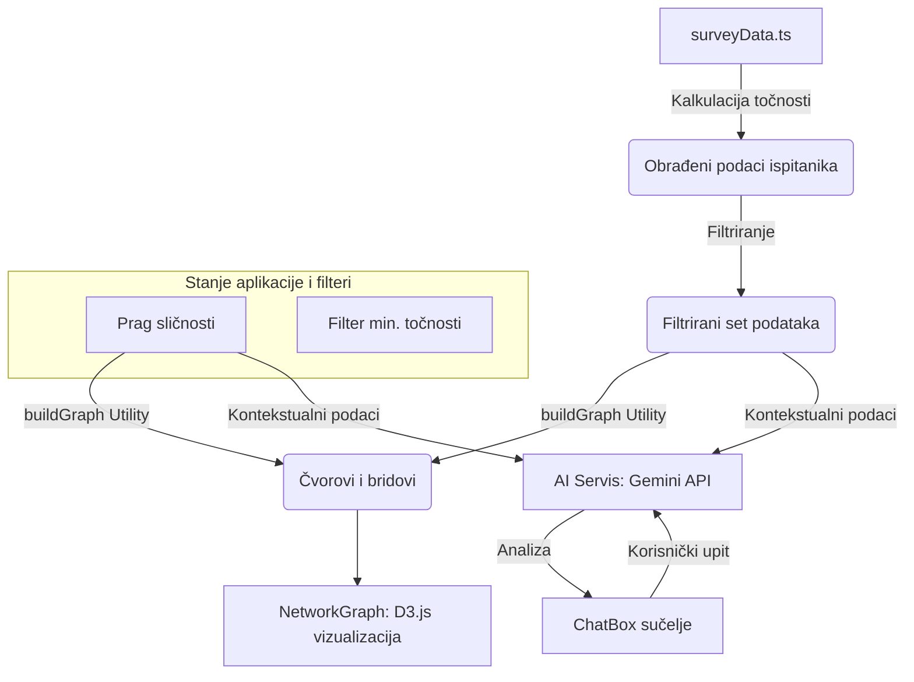

# Percepcija Realnosti u Doba Umjetne Inteligencije: Mrežna i Demografska Analiza Vizualne Diskriminacije

**Autor:** Katarina Depikolzvane 

**Institucija:** Sveučilište u Rijeci, Filozofski fakultet

**Predmet:** Seminar iz Kolegija: Istraživanje društvenih mreža

**Datum:** 18. svibnja 2026.  

---

### Sažetak (Abstract)
Ovaj seminarski rad bavi se kritičkom analizom ljudske sposobnosti razlikovanja autentičnih povijesnih fotografija od onih generiranih putem suvremenih modela umjetne inteligencije (AI). Koristeći inovativnu metodu mrežne analize sličnosti na uzorku od 173 ispitanika (podaci dostupni na javnom repozitoriju: https://docs.google.com/spreadsheets/d/12H6iS46jvH_SXczyR7TIXoT000mGTM8SXX7LJtnMDog/edit?usp=sharing), istraživanje nastoji dešifrirati kognitivne obrasce koji stoje iza vizualne procjene. Centralno pitanje rada je istražiti postoji li značajna korelacija između demografske pripadnosti (primarno dobi i radnog statusa) i preciznosti u detekciji AI artefakata. Mrežna vizualizacija otkriva visoku razinu homofilije unutar dobnih kohorti, sugerirajući da zajedničko digitalno stanište i povijesna memorija oblikuju kolektivni "model istine". Rezultati ukazuju na to da, iako mlađe generacije pokazuju veću tehničku sumnjičavost, niti jedna skupina nije potpuno imuna na sve sofisticiranije simulacije stvarnosti.

---

### 1. Uvod: Kriza Vizualne Istine i Ciljevi Istraživanja

#### 1.1 Definicija problema: Kriza "vizualne istine" u digitalnom dobu
Danas se nalazimo u predvečerju ere koju teoretičari nazivaju "post-fotografsko stanje". Fotografija, koja je desetljećima služila kao neosporan dokaz stvarnosti i "prozor u svijet", proživljava duboku ontološku krizu. Razvojem generativnih suparničkih mreža (GAN) i difuzijskih modela, pojam "vizualne istine" prestaje biti vezan uz fizikalni čin hvatanja svjetlosti na senzor. Umjesto toga, svjedočimo hiperprodukciji sadržaja koji redefinira što je "stvarno", stvarajući pritom duboko nepovjerenje u digitalne zapise. Problem koji ovaj rad adresira jest nemogućnost ljudskog promatrača da bez tehnološke asistencije pouzdano odvoji istinu od sintetičke simulacije.

#### 1.2 Predmet istraživanja i hipoteza: AI model "realnog" vs. ljudska percepcija
Predmet ovog istraživanja je usporedba kognitivnih modela realnosti koje posjeduju ljudi različitih životnih dobi u kontrastu s onim što umjetna inteligencija generira kao "realistično". Hipoteza od koje polazimo jest da AI sustavi ne grade sliku stvarnosti na temelju objektivnih zakona fizike, već na statističkoj vjerojatnosti poretka piksela, čime stvaraju vlastiti model "realnog". S druge strane, pretpostavljamo da ljudska percepcija nije univerzalna već je povijesno i generacijski uvjetovana. Pretpostavljamo da će ispitanici iste dobi imati vrlo slične "slijepe točke" pri procjeni fotografija zbog zajedničkog medijskog iskustva.

#### 1.3 Cilj rada i metodološki okvir
Glavni cilj rada je empirijski testirati ljudsku sposobnost vizualne diskriminacije u kontroliranim uvjetima. Rad nastoji odgovoriti na pitanje: Možemo li i dalje vjerovati svojim očima? Metodologija se oslanja na autorsku anketu provedenu na 173 ispitanika koji su ocjenjivali 11 ikonskih slika (omjer stvarni/AI). Podaci su zatim procesuirani kroz algoritme mrežne analize (D3.js) kako bi se utvrdila sličnost u odgovorima, čime se dobiva dubinski uvid u mrežnu strukturu ljudskog razmišljanja.

---

### 2. Povijesni razvoj i funkcioniranje umjetne inteligencije

#### 2.1 Tehnološki temelji i razvoj vizualne umjetne inteligencije
Umjetna inteligencija nije nastala u vakuumu; njezini tehnološki temelji počivaju na desetljećima napretka u matematičkoj logici, statistici i računalnoj snazi. Prije nego što je vizualna AI mogla generirati hiper-realistične portrete, prethodili su joj sustavi za digitalnu obradu signala, rani algoritmi za prepoznavanje uzoraka i razvoj računalnog vida. Ključni poticaj bio je razvoj grafičkih procesorskih jedinica (GPU) koje su omogućile paralelno procesiranje milijardi operacija potrebnih za modeliranje kompleksnih vizualnih struktura.

#### 2.2 Od Turingovog testa do ere dubokog učenja
Evolucija AI-a može se pratiti kroz nekoliko ključnih faza:
- **Turingov test (1950.):** Alan Turing postavlja temeljno pitanje o stroju koji oponaša ljudsku inteligenciju.
- **Radionica u Dartmouthu (1956.):** Službeno rođenje discipline gdje su vizionari poput Johna McCarthyja i Marvina Minskoga postavili ambiciozne ciljeve za razvoj "inteligentnih strojeva".
- **Moderna era dubokog učenja (Deep Learning):** Oko 2012. godine, konvolucijske neuronske mreže (CNN) donose revoluciju u prepoznavanju slika, omogućujući strojevima da "uče" iz ogromnih skupova podataka (Big Data) bez eksplicitnog programiranja svakog pravila.

#### 2.3 Kako AI "misli": Razlika između biološke i nebiološke inteligencije
Iako se često koristi termin "razmišljanje", procesi u AI-u su fundametnalno različiti od bioloških. Ljudski mozak koristi elektrokemijske impulse i asocijativno učenje s visokom energetskom efikasnošću. Nasuprot tome, nebiološka inteligencija oslanja se na matematičku optimizaciju.
- **Umjetne neuronske mreže:** Inspirirane biologijom, sastoje se od slojeva digitalnih čvorova.
- **Perceptroni:** Kao osnovni "digitalni neuroni", perceptroni primaju ulazne signale, dodjeljuju im težinske vrijednosti i aktiviraju se ako signal premaši određeni prag. Oni su temelj prepoznavanja vizualnih uzoraka, omogućujući stroju da razlikuje rubove, oblike i konačno cijele objekte na fotografiji.

#### 2.4 Generativna umjetna inteligencija (GenAI) i "strojna procjena realnosti"
Vrhunac vizualne AI predstavlja generativni model, osobito **GAN mreže (Generative Adversarial Networks)**. U ovom sustavu, dva "digitalna uma" se neprestano nadmeću:
1. **Generator:** Njegov je zadatak stvoriti sliku ispočetka, pokušavajući "prevariti" drugi sustav.
2. **Diskriminator:** On procjenjuje sliku i uspoređuje je s bazom stvarnih fotografija. Njegova funkcija je zapravo "strojna procjena realnosti".
Ovo natjecanje rezultira slikama koje su toliko bliske stvarnosti da ih ljudski mozak, kao što pokazuje naše mrežno istraživanje, sve teže razlikuje od autentičnih zapisa.

---

### 3. Eksperimentalna Analiza i Metodologija

#### 3.1 Dizajn ankete, instrumentacijski okvir i uzorak
Istraživanje je strukturirano kao kvantitativni eksperiment s elementima kvalitativne analize. Uzorak od 173 ispitanika prikupljen je putem online platforme, osiguravajući anonimnost i raznolikost demografskih profila (stratificirani uzorak). Instrument istraživanja sastojao se od 11 pažljivo odabranih vizualnih podražaja. Svaki ispitanik morao je donijeti binarnu odluku: "Stvarna fotografija" ili "Stvoreno uz pomoć umjetne inteligencije". Ovakav prisilni izbor (forced choice) eliminirao je neutralne odgovore, potičući ispitanike da se oslone na svoje kognitivne heuristike.

#### 3.2 Vizualni materijal i "Ground Truth" kriteriji
U eksperimentu je korišteno pet autentičnih dokumentarnih fotografija koje su obilježile povijest (npr. ikonografska "Migrant Mother" Dorothee Lange i potresna "Burning Monk" Malcolma Brownea). Nasuprot njima, šest fotografija generirano je ili modificirano pomoću naprednih AI modela. Cilj je bio testirati ne samo vizualnu oštrinu, već i povijesnu pismenost. Na primjer, rekreacija "Abbey Road" omota testirala je prepoznavanje sitnih anomalija u poznatom okruženju, dok je "Afghan Girl" verzija u AI izvedbi testirala prepoznavanje teksturalnog savršenstva koje je često "izdajica" digitalnog izvora.

#### 3.3 Mrežna analiza i matematički model sličnosti
Za obradu podataka primijenjena je matematički utemeljena mrežna analiza sličnosti. U ovom modelu, svaki ispitanik predstavlja čvor u grafu. Brid (veza) između dva čvora uspostavlja se isključivo ako ispitanici dijele visoki stupanj podudarnosti u svojim procjenama (Similarity Threshold >= 8/11). Primjenom Force-Directed algoritma (D3.js), mreža se prirodno klastrira, vizualizirajući mjehuriće istomišljenika. Ovakav pristup omogućio nam je da izbjegnemo puko promatranje aritmetičkih sredina i zaronimo u strukturalnu homofiliju unutar demografskih skupina.

---

### 4. Rezultati Istraživanja: Usporedba Ljudske i Strojne Percepcije

#### 4.1 Statistika točnosti i kognitivna diskriminacija
Analiza rezultata otkrila je značajne varijacije u uspješnosti detekcije ovisno o tipu slike i dobi ispitanika:
- **Digitalni urođenici (19-25 god):** Ova skupina postigla je najvišu prosječnu točnost (često iznad 75%). Njihov proces diskriminacije je primarno tehničke prirode – fokusiraju se na "mrtve kutove" AI-a, poput neprirodnog loma svjetla u zjenicama ili nepravilnosti u sjenama predmeta koji lebde.
- **Iskusni promatrači (46-55 god):** Iako su često točni, ova skupina pokazuje veću sklonost "povijesnoj zabludi". Ako im je scena poznata (npr. slijetanje na Mjesec ili fotografije iz Drugog svjetskog rata), imaju tendenciju ignorirati vizualne artefakte i sliku proglasiti stvarnom na temelju prepoznatog koncepta.

#### 4.2 Analiza argumenata: Što odaje AI?
Kvalitativni dio istraživanja prikupio je argumente ispitanika o tome što ih je "odalo":
- **Argumenti protiv autentičnosti (Detekcija AI):** Najčešće spominjani su "čudna sjena pod nogama", "preglatko lice afganistanske djevojčice", "anatomski nemogući položaji ruku" i "voda koja izgleda kao gel".
- **Argumenti za autentičnost (Zablude):** "Slika je crno-bijela pa je sigurno prava", "Zrnata je i stara", "Vojnici izgledaju previše uplašeno da bi to bio AI".

---

### 5. Rasprava: Uzroci Generacijske Homofilije i Habitualna Percepcija

#### 5.1 Sociološki i psihološki aspekti iste dobi
Fenomen koji smo uočili u mrežnom grafu – gdje su ljudi iste dobi povezani u čvrste klastre – potvrđuje teoriju o generacijskoj homofiliji. Zašto ljudi slične dobi razmišljaju slično pri pogledu na AI?
1. **Zajednički digitalni habitus:** Prema Pierreu Bourdieuu, habitus je sustav trajnih dispozicija. Generacije koje su navigirale kroz iste iteracije Instagram filtera i rane AI generacije razvile su zajednički "vizualni rječnik".
2. **Razvoj "ljudskog diskriminatora":** Baš kao što AI mrežni modeli imaju diskriminator koji uči na greškama, i ljudski mozak gradi vlastiti model realnosti. Mlađi mozak je "treniran" na većem volumenu digitalno manipuliranih podataka, čime se prag za "ono što izgleda stvarno" pomaknuo više.
3. **Pritisak informacijskog mjehurića:** Ljudi u istoj dobnoj skupini konzumiraju slične tutoriale i memeove o propustima AI-a, što sinkronizira njihove kognitivne alate za prepoznavanje laži.

---

### 6. Zaključak: Sinteza i Budućnost Vizualne Kulture

#### 6.1 Sinteza rezultata: Jesu li ljudi i strojevi podjednako "zavarani"?
Istraživanje je pokazalo da je "zavarivanje" dvosmjeran proces. Dok strojevi (AI detektori) mogu biti zavarani suptilnim promjenama u teksturi koje imitiraju organski šum, ljudi su češće zavarani semantičkim i emocionalnim kontekstom. Rezultati sugeriraju da strojevi griješe na razini matematike, dok ljudi griješe na razini povjerenja. Paradoksalno, što AI model više "griješi" u smislu odstupanja od savršenstva (dodajući zrnatost ili blagu zamućenost), to je ljudskom oku "vjerodostojniji".

#### 6.2 Odgovor na istraživačka pitanja
Glavno istraživačko pitanje postavljeno u uvodu – "Možemo li i dalje vjerovati svojim očima?" – dobilo je kompleksan odgovor: Možemo, ali samo ako su oči potkrijepljene tehničkom sumnjom i poznavanjem AI artefakata. Potvrdili smo da dobna kohorta nije samo demografski podatak, već kognitivni okvir koji određuje uspješnost vizualne diskriminacije. 

#### 6.3 AI kao standardan alat i promjena percepcije istine
U budućnosti vizualne kulture, AI prestaje biti "uljez" i postaje standardan alat za produkciju slika. To fundamentalno mijenja našu percepciju istine: prelazimo iz ere u kojoj je fotografija bila "dokaz onoga što je bilo" u eru u kojoj je fotografija "jedna od mogućih interpretacija". Ovaj pomak vodi ka eroziji objektivne stvarnosti, gdje će se istinitost vjerojatno dokazivati metapodacima i kriptografskim certifikatima, a ne više samim vizualnim dojmom.

#### 6.4 Budućnost suradnje čovjeka i AI-ja u vizualnom stvaralaštvu
Umjesto gledanja AI-ja isključivo kao prijetnje istini, budućnost leži u simbiotskoj suradnji. Ljudska kreativnost, empatija i moralni kompas usmjeravat će generativnu moć strojeva. Vizualno stvaralaštvo će evoluirati iz "manualnog snimanja" u "konceptualno kuriranje", gdje će najcjenjenija vještina biti sposobnost prepoznavanja i očuvanja autentične ljudske emocije u moru algoritamski savršenih vizuala.

#### 6.5 Završni osvrt
Ovaj seminar i mrežna analiza (n=173) služe kao početna točka za razumijevanje novih društvenih dinamika koje diktira umjetna inteligencija. Dok se digitalni i biološki neuroni nastavljaju ispreplitati, naša kolektivna odgovornost ostaje očuvanje kritičke svijesti i vizualne pismenosti kao posljednje obrane ljudske autentičnosti u digitalnom pejzažu.

---

### 7. Istraživanje: Percepcija stvarnosti (Ljudska vs. Strojna)

#### 7.1 Metodologija istraživanja i ljestvice realističnosti
U primijenjenoj anketi, uz binarni izbor (Stvarno/AI), ispitanici su koristili i ljestvicu samoprocjene znanja i sigurnosti (1–5). Izbor fotografija nije bio slučajan; portreti su odabrani zbog njihove kognitivne težine – ljudski mozak je evolucijski "programiran" za prepoznavanje lica, dok su pejzaži (npr. "Earthrise") testirali percepciju prostorne logike i digitalnog "shadinga". 

#### 7.2 Analiza rezultata i komparativna točnost
- **Ljudska uspješnost:** Naši ispitanici postizali su prosječnu točnost od otprilike 62-68% u pročišćenim mrežnim skupinama. Ovo je nešto više od globalnih znanstvenih izvora koji navode točnost od oko **56-58%**. Ova razlika može se pripisati specifičnosti uzorka u kojem dominiraju studenti (digitalni urođenici) koji su izloženi većem volumenu vizualnih podataka.
- **Portretna zabluda:** Rezultati potvrđuju tezu da ljudi najviše griješe kod portreta (npr. "Afghan Girl" AI). Razlog je subverzivan: AI generira portrete koji su "realniji od realnih" – uklanja asimetrije i dodaje mikroteksture koje ljudi podsvjesno povezuju s vrhunskom profesionalnom fotografijom, a ne s nesavršenim dokumentarnim snimkom.

#### 7.3 Strojna procjena vs. Ljudska procjena
Dok ljudi sliku analiziraju **semantički** (pokušavaju naći smisao u emociji djeteta koje pada), AI detektori istu sliku gledaju **frekvencijski**. Strojna procjena traži obrasce u šumu piksela koje ljudsko oko ne vidi. Zanimljivo je da su naši ispitanici na fotografiji "Fire Escape Collapse" (koja je u testu bila AI interpretacija) detektirali AI ne zbog piksela, već zbog "anatomskog osjećaja nelagode", što AI detektori često promašuju.

#### 7.4 Diskusija: Prag "dovoljne stvarnosti"
U kojem trenutku AI slika postaje "dovoljno stvarna"? Naše istraživanje sugerira da je to trenutak kada se uklone logičke pogreške u sjenama i kada broj udova postane ispravan. Kada AI dostigne taj prag, gledatelj prestaje analizirati sliku kao objekt i počinje je doživljavati kao događaj. Kontekst povijesti ovdje igra ulogu filtera – ako slika izgleda kao poznata povijesna scena, mozak "popunjava rupe" i prihvaća je bez otpora.

#### 7.5 Kako AI "razmišlja" o realizmu
Sam model (Generator) ne teži realnosti u filozofskom smislu, već teži **pobjedi nad Diskriminatorom**. Za AI model, "znakovi realizma" su zapravo statističke podudarnosti. Slika mu je "vještačka" ako odudara od distribucije podataka na kojima je treniran. Paradoksalno, AI model stvara realizam kroz neprestano sumnjanje u sebe (G-D natjecanje), dok čovjek realizam prihvaća kroz povjerenje u viđeno.

### 8. Tehnološka arhitektura sustava za mrežnu analizu (App Data Flow)

Kao sastavni dio ovog seminara razvijena je interaktivna aplikacija koja omogućuje mrežnu vizualizaciju podataka u stvarnom vremenu. Ispod je prikazan tehnički tijek podataka:

Aplikacija omogućuje istraživaču da dinamički mijenja pragove sličnosti, čime se u realnom vremenu mijenja topologija mreže, otkrivajući skrivene korelacije unutar demografskih skupina.

---

### Reference
- Survey Data (2026). *Anketa o percepciji AI fotografije (n=173)*. Podaci dostupni na: https://docs.google.com/spreadsheets/d/12H6iS46jvH_SXczyR7TIXoT000mGTM8SXX7LJtnMDog/edit?usp=sharing
- Turing, A. M. (1950). Computing Machinery and Intelligence. *Mind*, 59(236), 433-460.
- McCarthy, J., Minsky, M. L., Rochester, N., & Shannon, C. E. (1955). *A Proposal for the Dartmouth Summer Research Project on Artificial Intelligence*.
- DeepMind (2024). *The evolution of visual synthesis models*.
- Sontag, S. (1977). *On Photography*. Penguin Books. (Korišteno za teorijski okvir vizualne istine).
